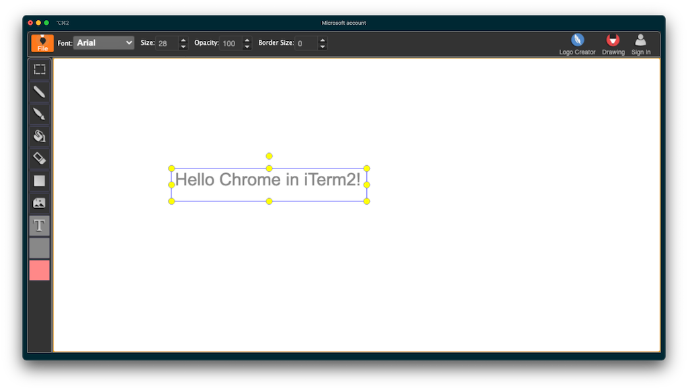

# Termser
#### Run a full web browser in your terminal

### Screenshot:


### Features:
* Run a full Chrome browser in your terminal ([iTerm2 only](https://www.iterm2.com/documentation-images.html) at the moment - low-res non-iTerm version WIP)
* Ideal for quick downloads or web debugging over SSH
* Blocks ads and trackers (configurable)
* Does not require a graphical browser install, runs a headless browser

### Installation:
```bash
git clone https://github.com/Niek/termser.git
cd termser
yarn install
```

### Running:
```
$ node . -h
termser [url]

Start Termser and load URL

Positionals:
  url  a unique identifier for the server   [default: "https://www.google.com/"]

Options:
  --version      Show version number                                   [boolean]
  --width, -w    Viewport width                         [number] [default: 1024]
  --adblock, -a  Block ads and trackers                [boolean] [default: true]
  -h, --help     Show help                                             [boolean]
```